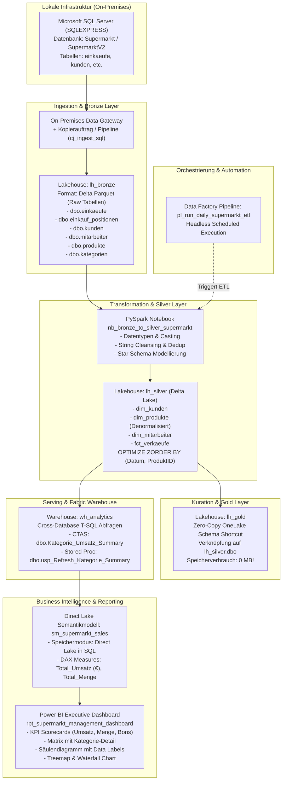

# End-to-End Showcase: Supermarkt Medallion Data Platform & Power BI Direct Lake

**Autor:** Alexander Fritzler  
**Fokus:** Microsoft Fabric Data Engineering (DP-700), Analytics Engineering (DP-600) & Power BI Direct Lake  
**Zielunternehmen / Rolle:** Würth IT GmbH — *Sales Solutions & BI-Systems / Data Analyst*

---

## 🏗️ Gesamtarchitektur

Das folgende Architekturdiagramm beschreibt den vollständigen Datenfluss von der operativen On-Premises SQL Server Datenbank bis zum interaktiven Executive Management Dashboard in Power BI über Microsoft OneLake.



---

## 📋 Schritt-für-Schritt Implementierungsanleitung

### Schritt 1: Workspace anlegen & Kapazität konfigurieren
1. In Microsoft Fabric links im Menü auf **Arbeitsbereiche** $\rightarrow$ **+ Neuer Arbeitsbereich**.
2. **Name:** `DP700_Supermarkt_Practice`.
3. Unter **Erweitert** $\rightarrow$ **Lizenzierungsmodus:** `Fabric-Testversion (Trial)` oder zugewiesene Fabric-Kapazität (F-SKU) auswählen $\rightarrow$ **Übernehmen**.

---

### Schritt 2: Bronze-Schicht anlegen & Rohdaten einlesen (Ingestion)
1. Im Workspace auf **+ Neues Element** $\rightarrow$ **Lakehouse** $\rightarrow$ Name: `lh_bronze`.
2. Datenübernahme aus der lokalen Supermarkt-Datenbank (via On-Premises Data Gateway und Kopierauftrag `cj_ingest_sql` oder Pipeline):
   * `dbo.einkaeufe`
   * `dbo.einkauf_positionen`
   * `dbo.kunden`
   * `dbo.mitarbeiter`
   * `dbo.produkte`
   * `dbo.kategorien`
3. Die Rohdaten liegen nun als unveränderte Delta-Parquet-Tabellen im OneLake Bronze-Speicher.

---

### Schritt 3: Silver-Schicht & PySpark Transformation (Star Schema)
1. Im Workspace auf **+ Neues Element** $\rightarrow$ **Lakehouse** $\rightarrow$ Name: `lh_silver`.
2. Oben auf **Daten analysieren mit** $\rightarrow$ **Neues Notebook** $\rightarrow$ Umbenennen in: `nb_bronze_to_silver_supermarkt`.
3. Links im Explorer auf **+ Datenelemente hinzufügen** $\rightarrow$ **Vorhandenes Lakehouse** $\rightarrow$ `lh_bronze` anbinden.
4. **PySpark ETL-Logik ausführen:**
   * Bereinigung der Kundendaten (`KundeID`, `VollstaendigerName`, `trim`, `dropDuplicates`).
   * Denormalisierung der Produktdaten (`dim_produkte` mit `KategorieName` für performante Star-Schema Abfragen).
   * Typisierung der Faktentabelle (`fct_verkaeufe`: Datumskonvertierung, `Einzelpreis`, `Gesamtbetrag = Menge * Einzelpreis`).
   * Schreiben als Delta-Tabellen mit `mode("overwrite")` nach `lh_silver.dbo`.
5. **Delta Lake Performance-Tuning:**
   ```sql
   %%sql
   -- Z-Order Clustering für extrem schnelle Filter & Joins
   OPTIMIZE lh_silver.dbo.fct_verkaeufe ZORDER BY (EinkaufDatum, ProduktID);

   -- Delta Log & Transaktionshistorie überprüfen
   DESCRIBE HISTORY lh_silver.dbo.fct_verkaeufe;
   ```

*(Das vollständige PySpark-Skript befindet sich in der Datei [`nb_bronze_to_silver_supermarkt.py`](nb_bronze_to_silver_supermarkt.py))*

---

### Schritt 4: Gold-Schicht & Zero-Copy OneLake Schema Shortcut
1. Im Workspace auf **+ Neues Element** $\rightarrow$ **Lakehouse** $\rightarrow$ Name: `lh_gold`.
2. Links im Explorer bei **Tables** auf die drei Punkte `...` klicken $\rightarrow$ **Neue Schemaverknüpfung** (Schema Shortcut).
3. Quelle: **Microsoft OneLake** $\rightarrow$ `lh_silver` auswählen $\rightarrow$ Haken bei `dbo` setzen $\rightarrow$ **Erstellen**.
4. **Ergebnis:** In `lh_gold` stehen alle sauberen Dimensionen und Fakten sofort bereit.
   * **Vorteil:** **0 MB zusätzlicher Speicherverbrauch** (Zero-Copy), keine Duplizierung von Daten, sofortige Synchronität mit Silver!

---

### Schritt 5: Orchestrierung per Data Factory Pipeline
1. Im Workspace auf **+ Neues Element** $\rightarrow$ **Datenpipeline** $\rightarrow$ Name: `pl_run_daily_supermarkt_etl`.
2. Aktivität **Notebook** hinzufügen und mit `nb_bronze_to_silver_supermarkt` verknüpfen.
3. Oben auf **Speichern** 💾 und **Ausführen** ▶ klicken.
4. Der gesamte Batch-Lauf verarbeitet alle Daten automatisiert und headless.

---

### Schritt 6: Fabric Warehouse & T-SQL Cross-Database Analytics
1. Im Workspace auf **+ Neues Element** $\rightarrow$ **Warehouse** $\rightarrow$ Name: `wh_analytics`.
2. Links im Explorer auf **+ Warehouses** klicken $\rightarrow$ `lh_silver` anhaken (ermöglicht nahtlose Cross-Database T-SQL Queries ohne ETL).
3. Ausführen der **CTAS (CREATE TABLE AS SELECT)** Abfrage zur Erstellung der vorkalkulierten Geschäfts-Datamart:
   ```sql
   CREATE TABLE dbo.Kategorie_Umsatz_Summary AS
   SELECT 
       p.KategorieName,
       f.Jahr,
       COUNT(DISTINCT f.EinkaufID) AS AnzahlEinkaeufe,
       SUM(f.Menge) AS Gesamtmenge,
       SUM(f.Gesamtbetrag) AS Gesamtumsatz,
       ROUND(AVG(f.Gesamtbetrag), 2) AS DurchschnittlicherUmsatzJePosten
   FROM [lh_silver].[dbo].[fct_verkaeufe] f
   LEFT JOIN [lh_silver].[dbo].[dim_produkte] p 
       ON f.ProduktID = p.ProduktID
   GROUP BY p.KategorieName, f.Jahr;
   ```
4. Erstellen einer Stored Procedure zur zyklischen Aktualisierung:
   ```sql
   CREATE OR ALTER PROCEDURE dbo.usp_Refresh_Kategorie_Summary
   AS
   BEGIN
       TRUNCATE TABLE dbo.Kategorie_Umsatz_Summary;
       INSERT INTO dbo.Kategorie_Umsatz_Summary
       SELECT 
           p.KategorieName,
           f.Jahr,
           COUNT(DISTINCT f.EinkaufID) AS AnzahlEinkaeufe,
           SUM(f.Menge) AS Gesamtmenge,
           SUM(f.Gesamtbetrag) AS Gesamtumsatz,
           ROUND(AVG(f.Gesamtbetrag), 2) AS DurchschnittlicherUmsatzJePosten
       FROM [lh_silver].[dbo].[fct_verkaeufe] f
       LEFT JOIN [lh_silver].[dbo].[dim_produkte] p 
           ON f.ProduktID = p.ProduktID
       GROUP BY p.KategorieName, f.Jahr;
   END;
   ```

*(Das vollständige T-SQL-Skript befindet sich in der Datei [`warehouse_analytics_ctas_sp.sql`](warehouse_analytics_ctas_sp.sql))*

---

### Schritt 7: Power BI Direct Lake Semantikmodell (`sm_supermarkt_sales`)
1. In `wh_analytics` oben auf **Neues Semantikmodell** klicken.
2. **Name:** `sm_supermarkt_sales`.
3. **Speichermodus:** `Direct Lake in SQL` (oder Direct Lake auf OneLake).
4. Tabelle auswählen: `[x] dbo.Kategorie_Umsatz_Summary` $\rightarrow$ **Bestätigen**.
5. Im Web-Datenmodellierungseditor oben rechts auf **Editing** (Bearbeiten) wechseln.
6. **Explizite DAX-Measures anlegen (Best Practice für Enterprise Reporting):**
   * **Umsatz-Kennzahl (Währung €):**
     ```dax
     Total_Umsatz = SUM(Kategorie_Umsatz_Summary[Gesamtumsatz])
     ```
     *Eigenschaften:* Format: `Currency` (€), Tausendertrennzeichen: `Ja`.
   * **Mengen-Kennzahl (Ganzzahl):**
     ```dax
     Total_Menge = SUM(Kategorie_Umsatz_Summary[Gesamtmenge])
     ```
     *Eigenschaften:* Format: `Whole number` (Ganzzahl).

---

### Schritt 8: Power BI Executive Management Dashboard (`rpt_supermarkt_management_dashboard`)
Oben in der Menüleiste des Semantikmodells auf **New report** klicken und das Dashboard aufbauen:

1. **Top-Level KPI-Scorecards (Karten):**
   * `Anzahl Einkaeufe`: **10**
   * `DurchschnittlicherUmsatzJePosten`: **11,82 €**
   * `Gesamtmenge`: **24**
   * `Total_Umsatz`: **23,61 €**
2. **Matrix-Tabelle (Detailübersicht):**
   * Zeilen: `KategorieName`
   * Werte: `AnzahlEinkaeufe`, `Gesamtmenge`, `Total_Umsatz` (inkl. `Gesamt`-Zeile: 23,61 €).
3. **Gruppiertes Säulendiagramm (Clustered Column Chart):**
   * X-Achse: `KategorieName`, Y-Achse: `Total_Umsatz`.
   * Sortiert nach Umsatz absteigend (*Süßigkeiten: 7,45 €*, *Obst & Gemüse: 4,50 €*, *Getränke: 4,47 €*, *Backwaren: 4,39 €*, *Milchprodukte: 2,80 €*).
   * **Datenbeschriftungen (Data Labels):** Aktiviert für sofortige Ablesbarkeit.
4. **Treemap:**
   * Visualisierung des physischen Verkaufsvolumens (`Gesamtmenge` nach Kategorie).
5. **Wasserfalldiagramm (Waterfall Chart):**
   * Kumulativer Aufbau des Gesamtumsatzes je Kategorie bis zur Gesamtsumme (23,61 €).
6. **Interaktives Cross-Filtering:**
   * Klick auf eine Kategorie (z. B. *Süßigkeiten*) filtert alle Karten, Tabellen und Wasserfall-Visuals in Echtzeit ohne Ladezeit (Direct Lake Performance!).
7. Dashboard speichern unter: **`rpt_supermarkt_management_dashboard`**.

---

## 🎯 Relevanz für Würth IT & DP-600 / DP-700 Interview

| Interview-Thema | Wie dieses Projekt es beweist |
| :--- | :--- |
| **End-to-End Verständnis** | Vom relationalen ERP-System (SQL Server) über Delta Lake bis zur Führungskräfte-Entscheidungsvorlage in Power BI. |
| **Architektur-Disziplin** | Klare Trennung nach Medallion-Standard (Bronze raw $\rightarrow$ Silver cleansed $\rightarrow$ Gold business ready $\rightarrow$ Warehouse serving). |
| **Zero-Copy & Kostenoptimierung** | Einsatz von OneLake Schema Shortcuts zur Vermeidung von Speicher- und Rechenzeitkosten. |
| **Performance-Engineering** | `OPTIMIZE ZORDER` auf Delta-Fakten; T-SQL CTAS Aggregationen für Sekundenschnelle Antwortzeiten. |
| **Direct Lake Expertise** | VertiPaq-Engine liest Parquet direkt aus OneLake – kein Import-Lag, kein träges DirectQuery. |
| **Business Value & DAX** | Saubere explizite Measures mit Formatierung und Management-gerechte Visualisierung nach IBCS-Prinzipien. |
