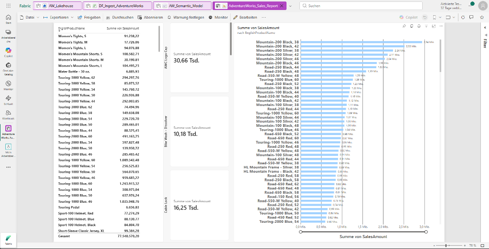
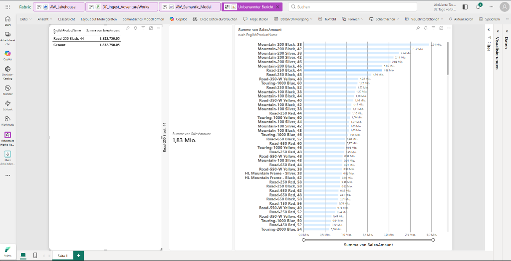

# Hybrid Ingestion & Direct Lake Analytics Platform
## Microsoft Fabric • On-Premises Data Gateway • SQL Server • Delta Lake • Power BI

---

### 1. Architektur & Projektübersicht

Dieses Projekt demonstriert eine vollständige, produktionsreife **End-to-End Hybrid Data Integration**:
Aus einem lokalen relationalen Data Warehouse (**SQL Server / AdventureWorksDW2020**) werden Unternehmensdaten über ein abgesichertes **On-Premises Data Gateway** direkt in die **Microsoft Fabric Cloud** extrahiert, als **Delta Lake (Parquet)** persistiert, über ein **Sternschema (Star Schema)** modelliert und ohne Zwischenspeicher (Import) über **Power BI Direct Lake** interaktiv visualisiert.

```mermaid
flowchart LR
    subgraph OnPremises ["Lokale Infrastruktur (On-Premises)"]
        SQL["SQL Server 2022<br/>AdventureWorksDW2020"]
        GW["On-Premises Data Gateway<br/>Local_Gateway_Alex_F"]
        SQL -->|Kanal Port 1433| GW
    end

    subgraph FabricCloud ["Microsoft Fabric Cloud"]
        DF["Dataflow Gen2<br/>DF_Ingest_AdventureWorks"]
        LH["OneLake Lakehouse<br/>AW_Lakehouse (Delta Tables)"]
        SM["Semantic Model<br/>AW_Semantic_Model (Direct Lake)"]
        PBI["Power BI Dashboard<br/>AdventureWorks_Sales_Report"]

        GW ==>|Azure Service Bus Relay| DF
        DF -->|Write Delta Parquet| LH
        LH -->|Direct Lake Zero-Copy| SM
        SM -->|Sub-Second Reporting| PBI
    end
```

---

### 2. Kernkomponenten & Implementierungsschritte

#### 2.1 On-Premises Gateway Konfiguration
- **Gateway-Name:** `Local_Gateway_Alex_F`
- **Gateway-Version:** `v3000.334.9 (On-Premises Data Gateway Standard)`
- **Sicherheit & Netzwerk:** Ausgehende verschlüsselte Verbindung via HTTPS / Azure Service Bus Relay (kein offener Port im lokalen Router erforderlich).
- **Service-Account & SQL Auth:**
  - Login: `fabric_user`
  - Rollenzuweisung: `db_owner` & `sysadmin` auf `AdventureWorksDW2020`.

#### 2.2 Ingestion via Dataflow Gen2
- Extrahierte Tabellen aus `AdventureWorksDW2020`:
  1. `DimDate` (Zeitdimension)
  2. `DimProduct` (Artikel- & Sortimentsstammdaten)
  3. `DimReseller` (Wiederverkäufer / Händlerstammdaten)
  4. `DimSalesTerritory` (Vertriebsregionen & Länder)
  5. `FactResellerSales` (Faktentabelle mit Verkaufszahlen, Mengen und Erlösen)
- **Data Destination:** `AW_Lakehouse` (Microsoft OneLake)
- **Speicherformat:** Apache Parquet mit `_delta_log` Transaktionsprotokoll (ACID-konform).

#### 2.3 Semantische Modellierung (Sternschema / Star Schema)
- Erstellung des semantischen Modells `AW_Semantic_Model` direkt auf dem Delta Lakehouse.
- **Beziehungen (1 : N):**
  - `DimProduct[ProductKey]` `1` <---> `*` `FactResellerSales[ProductKey]`
  - `DimReseller[ResellerKey]` `1` <---> `*` `FactResellerSales[ResellerKey]`
  - `DimSalesTerritory[SalesTerritoryKey]` `1` <---> `*` `FactResellerSales[SalesTerritoryKey]`

---

### 3. Ergebnisse & Power BI Dashboard

Das finale Dashboard `AdventureWorks_Sales_Report` nutzt die **Direct Lake Technologie**. Im Gegensatz zum klassischen DirectQuery (zu langsam) oder Import-Modus (erfordert ständige Aktualisierungen und verbraucht Speicher) greift Power BI direkt auf die Parquet-Spaltendateien im OneLake zu – mit nativer VertiPaq-Geschwindigkeit.

#### Dashboard-Übersicht & Interaktion

#### Interaktives Cross-Filtering (Beispielartikel: Road-250 Black, 44)
Durch Klicken auf ein Produkt werden alle KPI-Karten, Summen und Detailtabellen im Sub-Sekunden-Bereich synchron gefiltert:

---

### 4. Technologische Vorteile dieser Architektur

| Anforderung | Klassischer Legacy-Ansatz | Microsoft Fabric Direct Lake Ansatz |
| :--- | :--- | :--- |
| **Datentransfer** | Nächtliche Batch-Jobs via SSIS | Verschlüsselte Gateway-Pipelines / Dataflow Gen2 |
| **Datenhaltung** | Proprietäre relationale Datenbanken | Offener Standard: **Delta Lake / Apache Parquet** |
| **Speicheraufwand** | Duplikate in SQL DWH + Power BI Cache | **Zero Duplication** (OneLake als Single Source of Truth) |
| **Berichts-Latenz** | Import-Verzögerung von bis zu 24 Std. | **Sofortige Verfügbarkeit** bei Aktualisierung des Lakehouse |

---

### 5. Repository & KnowledgeBase Integration
Dieses Projekt ist Bestandteil der Data-Engineering-Referenzarchitekturen von **Alexander Fritzler**.
- **Autor:** Alexander Fritzler
- **LinkedIn:** [linkedin.com/in/alexander-fritzler-214628356](https://www.linkedin.com/in/alexander-fritzler-214628356/)
- **GitHub:** [github.com/alefritz19](https://github.com/alefritz19)
